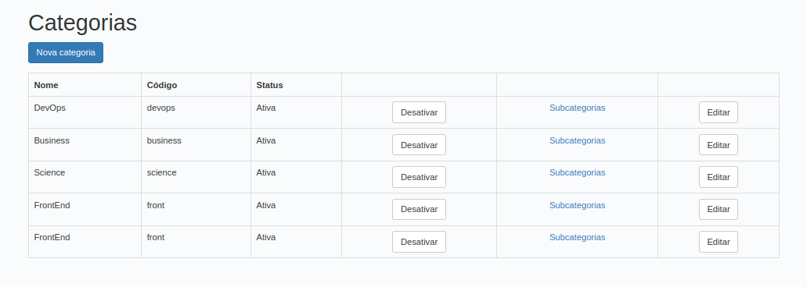
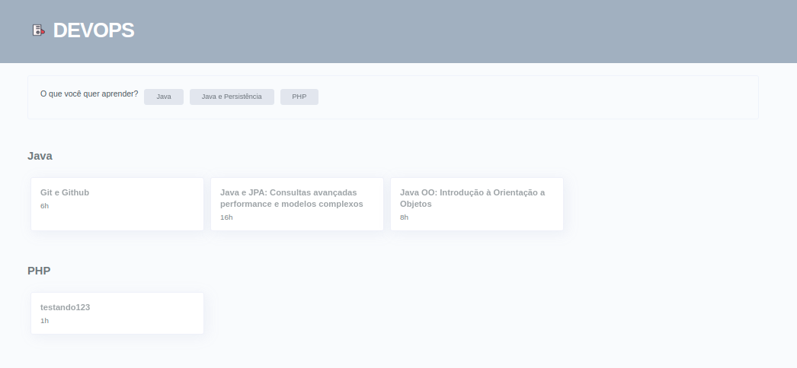
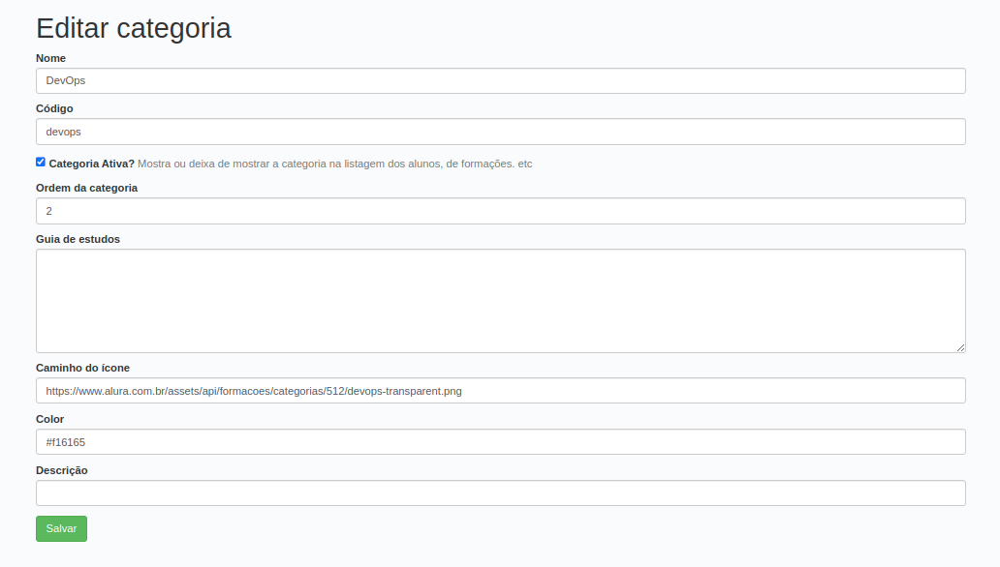

# HumanDev

A Java jsp plataform that create an EduTech environment, on that is possible to login with a manager account where you can do things like, 
create, edit and remove; categories, subcategories and courses matters. you can also login as an student where you can check the categories with courses, 
and your information.

## to run the project follow the steps bellow

HumanDev it's using by java 17, so the first step that you take is verify if you have a java 17 or superior in your computer
you can check in your terminal by the command below
```
java -version
```
If your version is not 17 or higher you can follow the steps down here

- first all, update all your packages to their latest version

- Install the jdk 17 
```
sudo apt-get update && sudo apt-get upgrade -y
```
and
```
sudo apt install openjdk-17-jdk -y
```
Check again if your java version is 17, just in case.
```
java -version
```

This project is using maven to manage the dependencies 

- Install maven 

checking if you already have it by
```
mvn -v
```

if you don't
```
sudo apt-get update && sudo apt-get upgrade -y
```
and
```
sudo apt-get install maven
```

The last but not least, you will need to install Mysql, our database :)

- Install the mysql
```
sudo apt-get update && sudo apt-get upgrade -y
```
and
```
sudo apt install mysql-server -y
```

open the terminal and try to access yr MySQL by 
```
mysql -u root -p
```
if you can't access by an empty password or your personal one, y'll have to reset your credentials by
```
sudo mysql -u root -e "ALTER USER 'root'@'localhost' IDENTIFIED WITH mysql_native_password BY'';  FLUSH PRIVILEGES;"
```
now you can try again, just leave the password empty and press enter
```
mysql -u root -p
```






Once everything is set up, in the running interface, you can fill in the url with the 'machine'
your email and your password, choose the environment that you are deploying, and push the START button
and wait for the bot do his thing.
