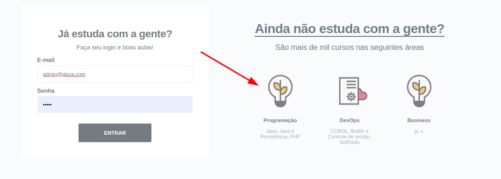

# HumanDev

A Java jsp plataform that create an EduTech environment, on that is possible to login with a manager account where you can do things like, 
create, edit and remove; categories, subcategories and courses matters. you can also login as an student where you can check the categories with courses, 
and your information.

## requirements to run the project, follow the steps below

HumanDev it's running by java 17, so the first step that you take is verify if you have a java 17 or superior in your computer
you can check it in your terminal by the command below
```
java -version
```
If your version is not 17 or higher you can follow the steps down here

- first all, update all your packages to their latest version

- Install the jdk 17 
```
sudo apt-get update && sudo apt-get upgrade -y
```
and
```
sudo apt install openjdk-17-jdk -y
```
Check again if your java version is 17, just in case.
```
java -version
```

This project is using maven to manage the dependencies 

- Install maven 

checking if you already have it by
```
mvn -v
```

if you don't
```
sudo apt-get update && sudo apt-get upgrade -y
```
and
```
sudo apt-get install maven
```

The last but not least, you will need to install Mysql, our database :)

- Install the mysql
```
sudo apt-get update && sudo apt-get upgrade -y
```
and
```
sudo apt install mysql-server -y
```

open the terminal and try to access yr MySQL by 
```
mysql -u root -p
```
if you can't access by an empty password or your personal one, y'll have to reset your credentials by
```
sudo mysql -u root -e "ALTER USER 'root'@'localhost' IDENTIFIED WITH mysql_native_password BY'';  FLUSH PRIVILEGES;"
```
now you can try again, just leave the password empty and press enter
```
mysql -u root -p
```

- Populating the database 

You can simply populate the database by using the dump file saved in /resources/dump-DB.sql,
run the project once to check if it has no errors, if all runs fine you'll have a new database
named humandev.

You'll be able to populate the database by using the command below, replacing "project-directory" with no quotes, to the directory 
where you had been cloned the project before.
```sudo mysql -u root- p humandev < "project-directory"/human-dev/src/main/resources/dump-DB.sql```

## Login

With the project up, go to ```http://localhost:8080/login``` in your web-browser

We've got 2 roles, 'adm' and 'student'
to log-in as an admin use:

user: ```admin@alura.com```
password: ```12345```


to access the admin panel log-in as an admin and go to ```http://localhost:8080/admin/categories```

here you can see all categories, edit or deactivate then or go to 'Subcategories' & 'Courses'


Back to mainPage ```http://localhost:8080/login``` on the right side, you can see all categories with more than one course and their information.



